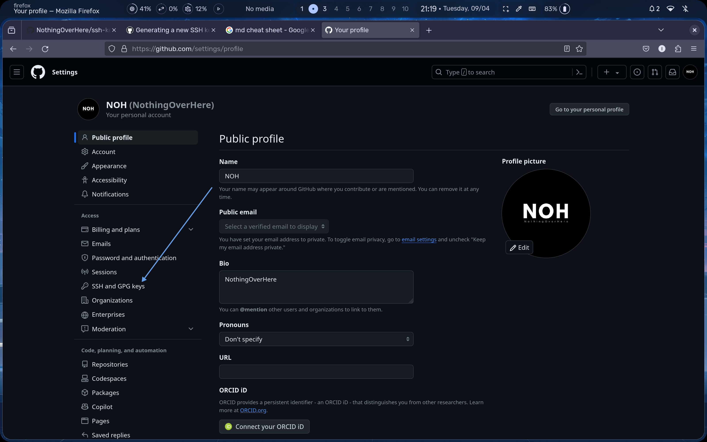

# Generating a new SSH key


1. Open Terminal.
2. Paste the text below

> Note : replacing the email used in the example with your **GitHub email address**.

```
ssh-keygen -t ed25519 -C "your_email"
```


###### Choose Location and File Name: You will be prompted to choose the location to save the SSH key pair. 
Press **Enter** to accept the **default** location (~/.ssh/id_rsa) or specify a different location if you prefer.
> Press the Enter 


###### Enter Passphrase (Optional): You'll be prompted to enter a passphrase.
A passphrase adds an extra layer of security to your SSH key.
If you choose to enter one, make sure to remember it,

as **you'll need it every time you use the SSH key**.

> You can choose to enter a passphrase or leave it blank. 


We have generated a key


we can see .ssh folder by using this command

```bash
ls -a
```


go to the .ssh folder


There are two keys


You can use the cat command to display the contents of the public key:

```bash
cat ~/.ssh/id_rsa.pub
```

###### Copy Public Key: The id_rsa.pub file contains your public key.
You can copy its contents and add it to the authorized_keys file on the remote server where you want to connect with SSH.


Open your web browser and navigate to GitHub.


Click on the "Settings" button.


Navigate to SSH and GPG Keys: In the left sidebar, click on "SSH and GPG keys."



Add a New SSH Key:

* Click on the "New SSH Key" button.
* In the "Title" field, provide a descriptive label for the new SSH key (e.g., "My Arch Linux SSH Key").
* In the "Key" field, paste the SSH public key you copied earlier.
* Review the SSH key to ensure it's correct.


After adding the SSH key, GitHub will display a success message.


You can generate a new SSH key on your local machine. 
After you generate the key, you can add the public key to your account on GitHub.com to enable authentication for Git operations over SSH.


