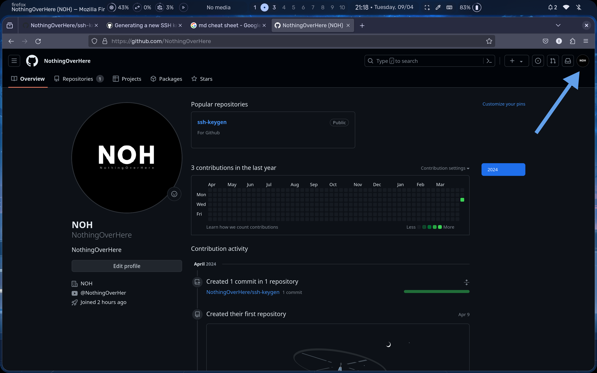
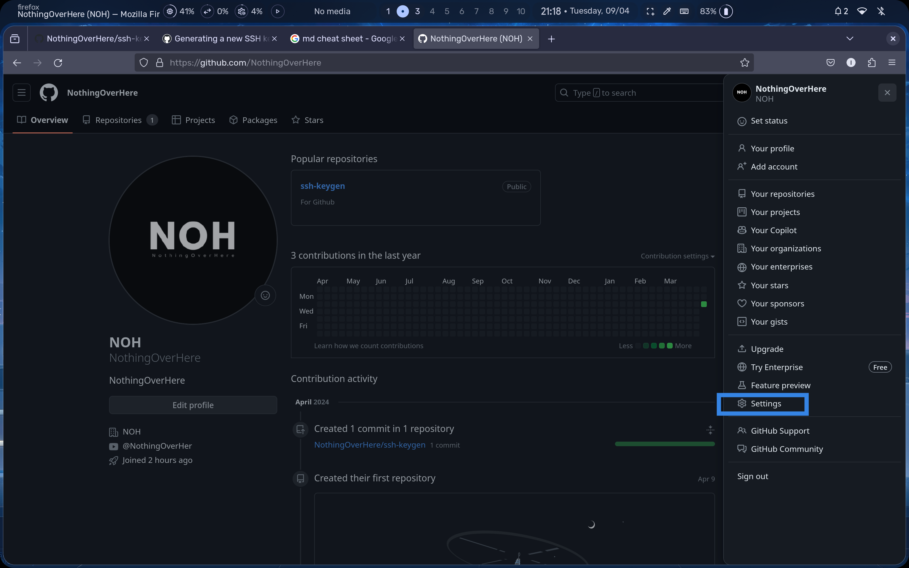

# Generating a new SSH key


1. Open Terminal.
2. Paste the text below

> Note : replacing the email used in the example with your GitHub **email address**.

```
ssh-keygen -t ed25519 -C "your_email"
```






You can generate a new SSH key on your local machine. 
After you generate the key, you can add the public key to your account on GitHub.com to enable authentication for Git operations over SSH.


